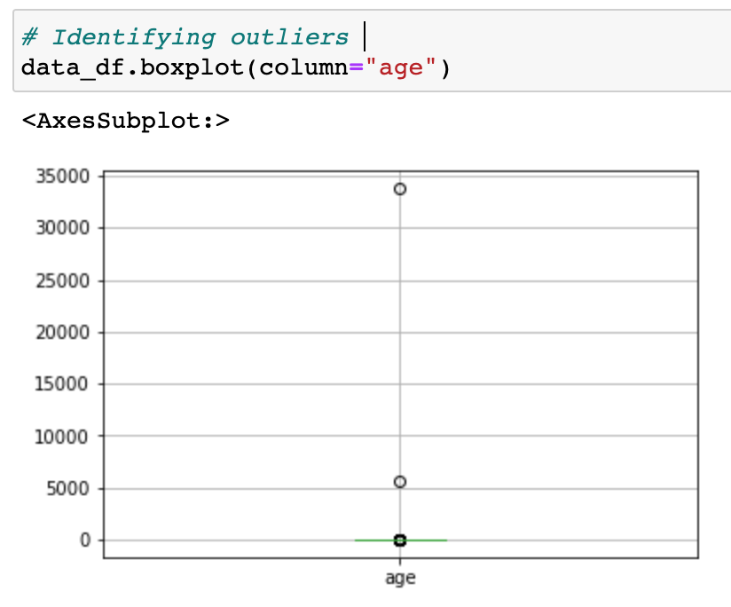
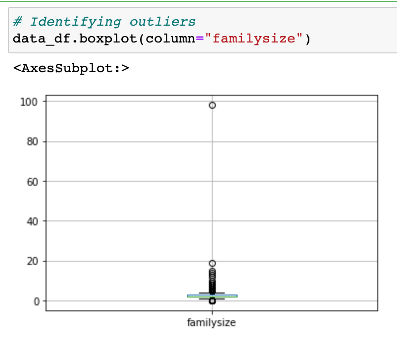
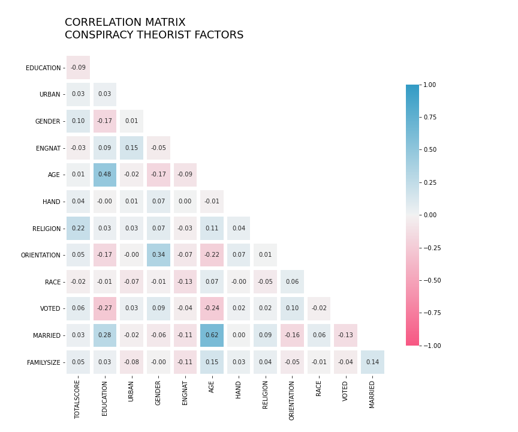
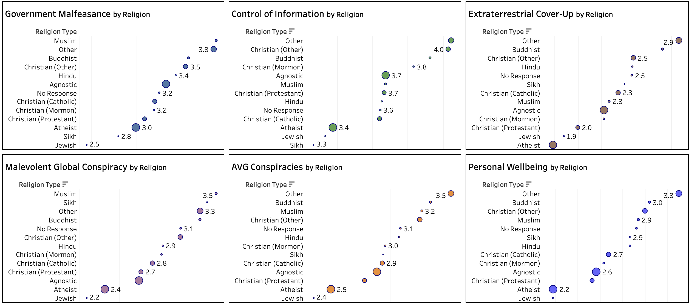
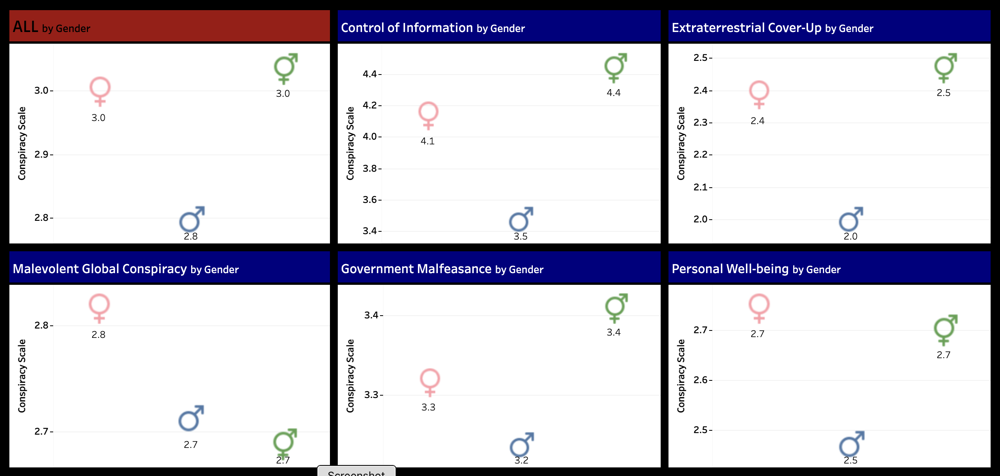
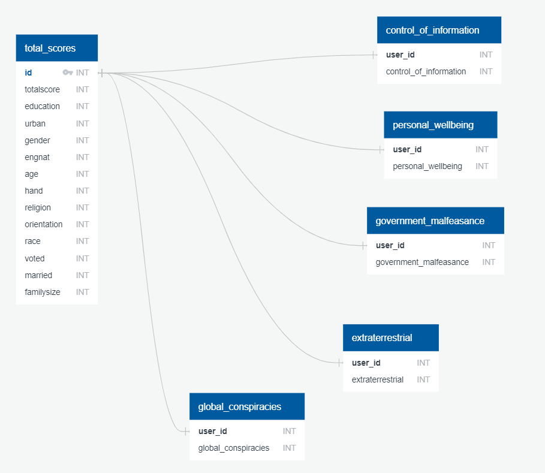

# Conspiracy_Theory_Final
A machine learning model about conspiracy theory beliefs based upon characterization of the individual.

## Why Conspiracies?
The group was intrigued by conspiracy theories given the rise of conspiracies across the mainstream over the past 5 years. The group decided it would be interesting to dive into data concerning conspiracy theories to gauge and quantify the types of characteristics of a conspiracy theorist.

## Dataset Description
This dataset was derived from the Generic Conspiracist Beliefs Scale (GCBS) which is used for researching conspiracy theories. Through an online application, visitors answered 15 questions with a 5 point scale. These questions were then grouped into the following categories of conspiracies:

|Group Factor|Abbreviation|
|:---|:---:|
|Goverment Malfeasance|GM|
|Extraterrestrial Cover-Up|ET|
|Malevolent Global Conspiracies|MG|
|Personal Wellbeing|PW|
|Control of Information|CI|

Other characteristics of the respondants were also captured:
* **Education**: Less than high school, high school, university degree, graduate degree
* **Childhood Living**: Urban, Rural, Suburban
* **Gender**: Male, Female, Other
* **English as Native Language**: Yes, No
* **Age**: Enter your age
* **Dominant Hand**: Right, Left, Both
* **Religion**: Agnostic, Atheist, Buddhist, Christian (Catholic), Christian (Mormon), Christian (Protestant), Christian (Other), Hindu, Jewish, Muslim, Sikh, Other
* **Sexual Orientation**: Heterosexual, Bisexual, Homosexual, Asexual, Other
* **Race**: Asian, Arab, Black, Indigenous Australian - Native American - White, Other
* **Voted in National Election in Past Year**: Yes, No
* **Married**: Never Married, Currently Married, Previously Married
* **Family Size**: Enter the number of children your mother had, including yourself

## Outline of Project
1. Identify the datasource
    - Link: ["Measuring Belief In Conspiracy Theories"](https://www.kaggle.com/yamqwe/measuring-belief-in-conspiracy-theories?select=data)
    - Description: Collected in 2016 using an online version of the Generic Conspiracists Beliefs Scale. This dataset includes responses from roughly 2,495 individuals. The questionnaire categorizes individuals into types of conspiracy theorists based on their responses. In addition, features of the individuals are also collected where a machine learning model can be applied to predict whether a person is a conspiracy theorist and what type.

2. Topic Decision
    - We decided this predictive approach to identifying conspiracy theorists based on individual features would be an interesting approach to machine learning, especially given the increased global discussion surrounding conspiracies over the last five years.

3. What Do We Want To Answer?
    - Based on your own personal features, what type(s) of conspiracy theorist are you?

4. Dataset Limitations
    - Data is from 2016 and does not factor additional theories which have emerged since then: i.e. COVID-19.
    
5. Recommendations for expanded analysis
    - Perform this questionnaire with a population and collect where they live at the time of taking the survey. A map showing where certain types of conspiracies are more prevalent would be highly interesting.

## Data Exploration
  - The csv file was imported into a Pandas DataFrame
  - Dropped null data from dataset
  - Removed unnecessary data:
    - Personality Indicators - the results of these did lend itself to a better assessment and inserted additional ambiguity
    - Time (introelapse, testelapse, surveyelapse) - time spent on the page and between the two sets of questions are not relevant
    - Major - Not necessary for prediction as all did not complete college
    - Vocabulary Assessment - more of a lazy aptitude test and not relevant when academic profile are captured
  - Binned data for overall assessment of Yes/No for conspiracy theorist
  - Removed outliers - the following images display the outliers in two features
    - Age: One individual indicated they were nearly 35,000 years old while another was over 5,000 years old
    - Family Size: One individual stated their mother had nearly 100 children

  
## Analysis 
In reviewing the various factors from the people who took the survey, we decided it would be useful to look at a correlation matrix. We quickly realized a majority of the factors do not have a correlation at all with the overall total scores. The following correlation matrix shows **Religion** and **Gender** having the most correlation to total scores, though small.

### RELIGION
These charts show the average scores of each conspiracy theory for each type of religion. The size of the bubbles indicate how many of the respondents identified with that particular religion. The scale was based on the average scores for each conspiracy theory as well as the overall scores.

### GENDER
Males were far less likely to believe in conspiracy theories than those who identified as Female or Other.

### ERD
Our database contains a main table (total_scores) which captures the features of each person who took the survey as well as their total scores. The user_id is the primary key in this table. The user_id is then used as the foreign key to the theorist-type tables. This allows for the following benefits:
* Quick retrieval of data
* Mitigating redundant data in child tables
* Preserving data integrity by having the features of each person stored once

## Google Slide Presentation Link
[The Lizard People](https://docs.google.com/presentation/d/1Yfqv1jFfF3fEBV6npjox3hcjP84kX47o3FywaWDZ9HI/edit#slide=id.gf9adcef9b2_0_124)

## Our Team Communication Protocols
The Lizard Team has established a collaboration plan to include meetings, communication platforms and in case of an emergency.

### MEETINGS
**SCHEDULED via ZOOM**
* Tuesday/Thursday during regularly scheduled classes
* Saturday during and post office hours

**AD HOC**
* As needed

### COMMUNICATION
* Group chat on Slack for team members only

### EMERGENCY
* Established a group on our own personal cell phones for emergency items

